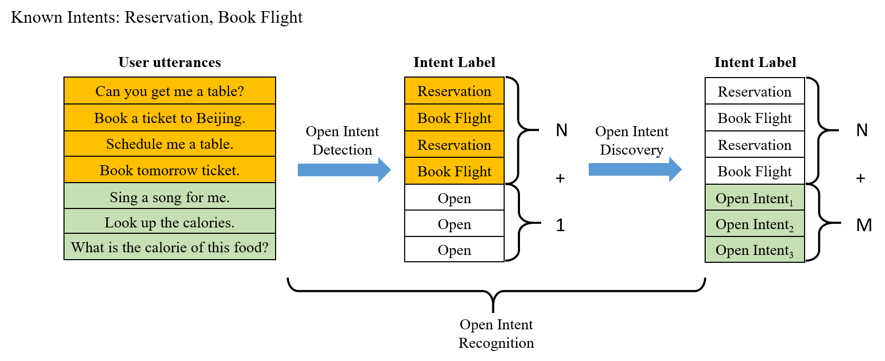

# TEXT Open Intent Recognition (TEXTOIR)

TEXTOIR is the first high-quality Text Open Intent Recognition platform. This repo contains a convenient toolkit with extensible interfaces, integrating a series of algorithms of two tasks (open intent detection and open intent discovery). We also release the pipeline framework and the visualized platform in the repo [TEXTOIR-DEMO](https://github.com/thuiar/TEXTOIR-DEMO). 

If you are interested in this work, and want to use the codes in this repo, please **star** or **fork** this repo, and cite our [ACL 2021 demo paper](https://aclanthology.org/2021.acl-demo.20.pdf):
```
@inproceedings{zhang-etal-2021-textoir,
    title = "{TEXTOIR}: An Integrated and Visualized Platform for Text Open Intent Recognition",
    author = "Zhang, Hanlei  and
      Li, Xiaoteng  and
      Xu, Hua  and
      Zhang, Panpan  and
      Zhao, Kang  and
      Gao, Kai",
    booktitle = "Proceedings of the 59th Annual Meeting of the Association for Computational Linguistics and the 11th International Joint Conference on Natural Language Processing: System Demonstrations",
    year = "2021",
    pages = "167--174",
}
```

## Introduction
TEXTOIR aims to provide a convenience toolkit for researchers to reproduce the related text open classification and clustering methods. It contains two tasks, which are defined as open intent detection and open intent discovery. Open intent detection aims to identify n-class known intents, and detect one-class open intent. Open intent discovery aims to leverage limited prior knowledge of known intents to find fine-grained known and open intent-wise clusters. Related papers and codes are collected in our previous released [reading list](https://github.com/thuiar/OKD-Reading-List).

Open Intent Recognition:  


 **We strongly recommend you to use our TEXTOIR toolkit, which has standard and unified interfaces (especially data setting) to obtain fair and persuable results on benchmark intent datasets!**

## Benchmark Datasets
* [BANKING](https://arxiv.org/pdf/2003.04807.pdf)
* [OOS / CLINC150 (without OOD samples)](https://arxiv.org/pdf/1909.02027.pdf) 
* [StackOverflow](https://aclanthology.org/W15-1509.pdf)


## Integrated Models
### Open Intent Detection

* [Out-of-Scope Intent Detection with Self-Supervision and Discriminative Training](https://aclanthology.org/2021.acl-long.273) (MixUp, ACL IJCNLP 2021)
* [Unknown Intent Detection Using Gaussian Mixture Model with an Application to Zero-shot Intent Classification](https://aclanthology.org/2020.acl-main.99) (SEG, ACL 2020)
* [Deep Open Intent Classification with Adaptive Decision Boundary](https://ojs.aaai.org/index.php/AAAI/article/view/17690) (ADB, AAAI 2021)
* [Deep Unknown Intent Detection with Margin Loss](https://aclanthology.org/P19-1548.pdf) (DeepUnk, ACL 2019)
* [DOC: Deep Open Classification of Text Documents](https://aclanthology.org/D17-1314.pdf) (DOC, EMNLP 2017)
* [A Baseline For Detecting Misclassified and Out-of-distribution Examples in Neural Networks](https://arxiv.org/pdf/1610.02136.pdf) (MSP, ICLR 2017) 
* [Towards Open Set Deep Networks](https://openaccess.thecvf.com/content_cvpr_2016/papers/Bendale_Towards_Open_Set_CVPR_2016_paper.pdf) (OpenMax, CVPR 2016)


### Open Intent Discovery

* Semi-supervised Clustering Methods
    - [Discovering New Intents with Deep Aligned Clustering](https://ojs.aaai.org/index.php/AAAI/article/view/17689) (DeepAligned, AAAI 2021)
    - [Discovering New Intents via Constrained Deep Adaptive Clustering with Cluster Refinement](https://ojs.aaai.org/index.php/AAAI/article/view/6353) (CDAC+, AAAI 2020)
    - [Learning to Discover Novel Visual Categories via Deep Transfer Clustering](https://www.robots.ox.ac.uk/~vgg/research/DTC/files/iccv2019_DTC.pdf) (DTC*, ICCV 2019)
    - [Multi-class Classification Without Multi-class Labels](https://openreview.net/pdf?id=SJzR2iRcK7) (MCL*, ICLR 2019)
    - [Learning to cluster in order to transfer across domains and tasks](https://openreview.net/pdf?id=ByRWCqvT-) (KCL*, ICLR 2018)
* Unsupervised Clustering Methods
    - [Towards K-means-friendly Spaces: Simultaneous Deep Learning and Clustering](http://proceedings.mlr.press/v70/yang17b/yang17b.pdf) (DCN, ICML 2017)
    - [Unsupervised Deep Embedding for Clustering Analysis](http://proceedings.mlr.press/v48/xieb16.pdf) (DEC, ICML 2016)
    - Stacked auto-encoder K-Means (SAE-KM)
    - Agglomerative clustering (AG)
    - K-Means (KM)

(* denotes the CV model replaced with the BERT backbone)

## Quick Start
1. Use anaconda to create Python (version >= 3.6) environment
```
conda create --name textoir python=3.6
conda activate textoir
```
2. Install PyTorch (Cuda version 11.2)
```
conda install pytorch torchvision torchaudio cudatoolkit=11.0 -c pytorch -c conda-forge  
```
2. Clone the TEXTOIR repository, and choose the task (Take open intent detection as an example).
```
git clone git@github.com:HanleiZhang/TEXTOIR.git
cd TEXTOIR
cd open_intent_detection
```
3. Install related environmental dependencies
```
pip install -r requirements.txt
```
4. Run examples (Take ADB as an example)
```
sh examples/run_ADB.sh
```

## Extensibility and Reliability

### Extensibility
This toolkit is extensible and supports adding new methods, datasets, configurations, backbones, dataloaders, losses conveniently. More detailed information can be seen in the directory [open_intent_detection](./open_intent_detection/README.md) and [open_intent_discovery](./open_intent_discovery/README.md) respectively. 

### Reliability
The codes in this repo have been confirmed and are reliable. The experimental results are close to the reported ones in our AAAI 2021 papers [Discovering New Intents with DeepAligned Clustering](https://ojs.aaai.org/index.php/AAAI/article/view/17689) and [Deep Open Intent Classification with Adaptive Decision Boundary](https://ojs.aaai.org/index.php/AAAI/article/view/17690). Note that the results of some methods may fluctuate in a small range due to the selected random seeds, hyper-parameters, optimizers, etc. The final results are the average of 10 random seeds to reduce the influence of different selected known classes.

## Acknowledgements

Toolkit Contributors: Hanlei Zhang, Ting-En Lin, Qianrui Zhou, Shaojie Zhao, Xin Wang, Huisheng Mao. 

Supervisor: Hua Xu.

## Bugs or questions?

If you have any questions, feel free to open issues and pull request. Please illustrate your problems as detailed as possible. If you want to integrate your method in our repo, please contact us (zhang-hl20@mails.tsinghua.edu.cn).
