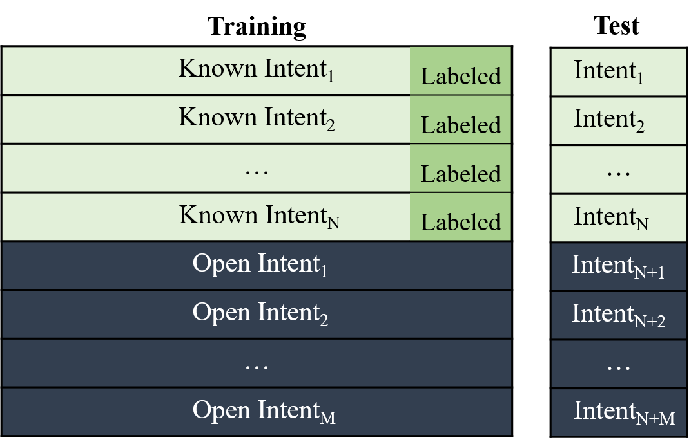

# Open Intent Discovery

This package provides the toolkit for open intent discovery implemented with PyTorch (for semi-supervised clustering methods), and Tensorflow (for unsupervised clustering methods).

## Introduction

Open intent discovery aims to leverage limited labeled data of known intents to help find discover open intent clusters. We regard it as a clustering problem, and classifies the related methods into two categories, semi-supervised clustering (with some labeled known intent data as prior knowledge), and unsupervised clustering (without any prior knowledge). An example is as follows:



We collect benchmark intent datasets, and reproduce related methods to our best. For the convenience of users, we provide flexible and extensible interfaces to add new methods. Welcome to contact us (zhang-hl20@mails.tsinghua.edu.cn) to add your methods!

## Basic Information

### Benchmark Datasets
| Dataset Name | Source |
| :---: | :---: |
| [BANKING](../data/banking) | [Paper](https://aclanthology.org/2020.nlp4convai-1.5/) [Dataset](https://github.com/PolyAI-LDN/task-specific-datasets) |
| [CLINC (without 1200 out-of-score samples)](../data/clinc) | [Paper](https://arxiv.org/pdf/1909.02027.pdf) [Dataset](https://github.com/clinc/oos-eval) |

### Integrated Models

* Semi-supervised Clustering Methods

| Model Name | Source | Published |
| :---: | :---: | :---: |
| [DeepAligned](./examples/run_DeepAligned.sh) | [Paper](https://ojs.aaai.org/index.php/AAAI/article/view/17689) [Code](https://github.com/thuiar/DeepAligned-Clustering) | AAAI 2021 |
| [CDAC+](./examples/run_CDACPlus.sh) | [Paper](https://ojs.aaai.org/index.php/AAAI/article/view/6353) [Code](https://github.com/thuiar/CDAC-plus) | AAAI 2020 |
| [DTC*](./examples/run_DTC.sh) | [Paper](https://www.robots.ox.ac.uk/~vgg/research/DTC/files/iccv2019_DTC.pdf) [Code](https://github.com/k-han/DTC) | ICCV 2019 |
| [MCL*](./examples/run_MCL.sh) | [Paper](https://openreview.net/pdf?id=SJzR2iRcK7) [Code](https://github.com/GT-RIPL/L2C) | ICLR 2019 |
| [KCL*](./examples/run_KCL.sh) | [Paper](https://openreview.net/pdf?id=ByRWCqvT-) [Code](https://github.com/GT-RIPL/L2C) | ICLR 2018 |

* Unsupervised Clustering Methods

| Model Name | Source | Published |
| :---: | :---: | :---: |
| [DCN](./examples/run_DCN.sh) | [Paper](http://proceedings.mlr.press/v70/yang17b/yang17b.pdf) [Code](https://github.com/xuyxu/Deep-Clustering-Network) | ICML 2017 |
| [DEC](./examples/run_DEC.sh) | [Paper](http://proceedings.mlr.press/v48/xieb16.pdf) [Code](https://github.com/piiswrong/dec) | ICML 2016 |
| [SAE-KM](./examples/run_SAE.sh) | [Paper](https://www.jmlr.org/papers/volume11/vincent10a/vincent10a.pdf)  | JMLR 2010|
| [AG](./examples/run_AG.sh) | [Paper](https://www.sciencedirect.com/science/article/abs/pii/0031320378900183) | PR 1978 |
| [KM](./examples/run_KM.sh) | [Paper](https://www.cs.cmu.edu/~bhiksha/courses/mlsp.fall2010/class14/macqueen.pdf) | 1967 |


We welcome any issues and requests for model implementation and bug fix. 

### Data Settings

Each dataset is split to training, development, and testing sets. We select partial intents as known (the labeled ratio can be changed) intents. Notably, we uniformly select 10% as labeled from known intent data. We use all training data (both labeled and unlabeled) to train the model. During testing, we evaluate the clustering performance of all intent classes. More detailed information can be seen in the [paper](https://ojs.aaai.org/index.php/AAAI/article/view/17689).

### Parameter Configurations

The basic parameters include parsing parameters about selected dataset, method, setting, etc. More details can be seen in [run.py](./run.py). For specific parameters of each method, we support add configuration files with different hyper-parameters in the [configs](./configs) directory. 

An example can be seen in [DeepAligned.py](./configs/DeepAligned.py). Notice that the config file name is corresponding to the parsing parameter.

Normally, the input commands are as follows:
```
python run.py --setting xxx --dataset xxx --known_cls_ratio xxx --labeled_ratio xxx --cluster_num_factor xxx --config_file_name xxx
```

Notice that if you want to train the model, save the model, or save the testing results, you need to add related parameters (--train, --save_model, --save_results)

## Tutorials
### a. How to add a new dataset? 
1. Prepare Data  
Create a new directory to store your dataset in the [data](../data) directory. You should provide the train.tsv, dev.tsv, and test.tsv, with the same formats as in the provided [datasets](../data/banking).

2. Dataloader Setting  
Calculate the maximum sentence length (token unit) and count the labels of the dataset. Add them in the [file](./configs/__init__.py) as follows:  
```
max_seq_lengths = {
    'new_dataset': max_length
}
benchmark_labels = {
    'new_dataset': label_list
}
```

### b. How to add a new backbone?

1. Add a new backbone in the [backbones](./backbones) directory. For example, we provide [bert-based](./backbones/bert.py), [glove-based](./backbones/glove.py), and [sae-based](./backbones/sae.py) backbones.

2. Add the new backbone mapping in the [file](./backbones/__init__.py) as follows:
```
from .bert import new_backbone_class
backbones_map = {
    'new_backbone': new_backbone_class
}
```
Add a new loss in the [losses](./losses) directory is almost the same as adding a new backbone.

### c. How to add a new method?

1. Configuration Setting   
Create a new file, named "method_name.py" in the [configs](./configs) directory, and set the hyper-parameters for the method (an example can be seen in [DeepAligned.py](./configs/DeepAligned.py)). 

2. Dataloader Setting  
Add the dataloader mapping if you use new backbone for the method. For example, the bert-based model corresponds to the bert dataloader as follows.
```
from .bert_loader import BERT_Loader
backbone_loader_map = {
    'bert': BERT_Loader,
    'bert_xxx': BERT_Loader
}
```
The unsupervised clustering methods use the unified dataloader as follows:
```
from .unsup_loader import UNSUP_Loader
backbone_loader_map = {
    'glove': UNSUP_Loader,
    'sae': UNSUP_Loader
}
```

3. Add Methods  (Take DeepAligned as an example)

- Classify the method into the corresponding category in the [methods](./methods) directory. For example, DeepAligned belongs to the [semi-supervised](./methods/semi_supervised) directory, and creates a subdirectory under it, named "DeepAligned". 

- Add the manager file for DeepAligned. The file should include the method manager class (e.g., DeepAlignedManager), which includes training, evalutation, and testing modules for the method. An example can be seen in [manager.py](./methods/semi_supervised/DeepAligned/manager.py).  

- Add the related method dependency in [__init__.py](./methods/__init__.py) as below:
```
from .semi_supervised.DeepAligned.manager import DeepAlignedManager
method_map = {
    'DeepAligned': DeepAlignedManager
}
```
(The key corresponds to the input parameter "method")

4. Run Examples
Add a script in the [examples](./examples) directory, and configure the parsing parameters in the [run.py](./run.py). You can also run the programs serially by setting the combination of different parameters. A running example is shown in [run_DeepAligned.sh](./examples/run_DeepAligned.sh).

## Citation
If you are interested in this work, and want to use the codes in this repo, please star/fork this repo, and cite the following works:

* [TEXTOIR: An Integrated and Visualized Platform for Text Open Intent Recognition](https://aclanthology.org/2021.acl-demo.20/)
* [Discovering New Intents with Deep Aligned Clustering](https://arxiv.org/pdf/2012.08987.pdf)

```
@inproceedings{zhang-etal-2021-textoir,
    title = "{TEXTOIR}: An Integrated and Visualized Platform for Text Open Intent Recognition",
    author = "Zhang, Hanlei  and Li, Xiaoteng  and Xu, Hua  and Zhang, Panpan and Zhao, Kang  and Gao, Kai",
    booktitle = "Proceedings of the 59th Annual Meeting of the Association for Computational Linguistics and the 11th International Joint Conference on Natural Language Processing: System Demonstrations",
    pages = "167--174",
    year = "2021",
    url = "https://aclanthology.org/2021.acl-demo.20",
    doi = "10.18653/v1/2021.acl-demo.20",
}
```
```
@article{Zhang_Xu_Lin_Lyu_2021, 
    title={Discovering New Intents with Deep Aligned Clustering}, 
    volume={35}, 
    number={16}, 
    journal={Proceedings of the AAAI Conference on Artificial Intelligence}, 
    author={Zhang, Hanlei and Xu, Hua and Lin, Ting-En and Lyu, Rui}, 
    year={2021}, 
    month={May}, 
    pages={14365-14373}
}
```


